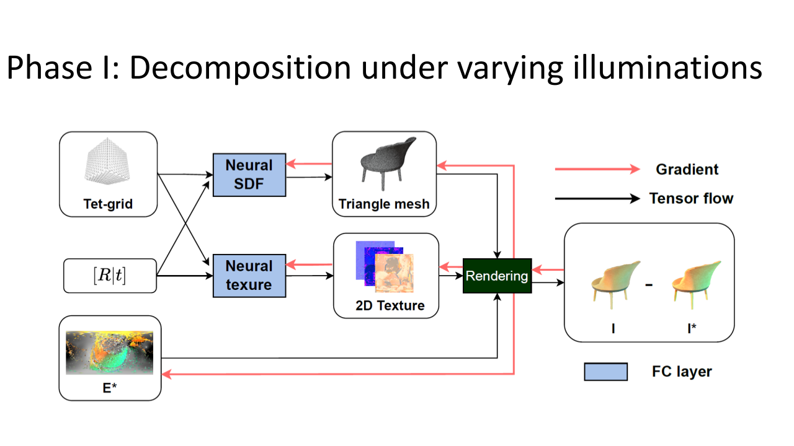
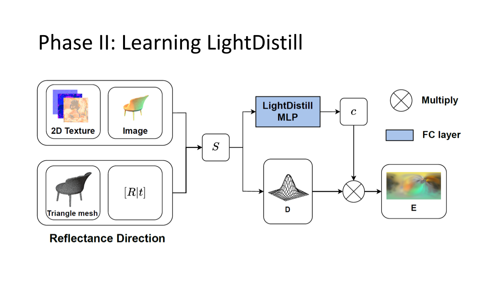

# LightDistill: Predicting View-Dependent Lighting from a Single Image - demo



## Run a quick simplified demo

Run a GPU version demo by
```
python demo_gpu.py
```

Run a CPU version demo by
```
python demo_cpu.py
```

The code can also be run in Colab without extra packages.

The follow files would be produced:
```
LightDistill_env.png
gt_relit.png
ALP_relit.png
Nvdiffrec_relit.png
LightDistill_relit.png
Comparison_env.png
Comparison_relit.png

sphere_2D_visual.png
sphere2envmap_visual.png
combined_visual.png
```